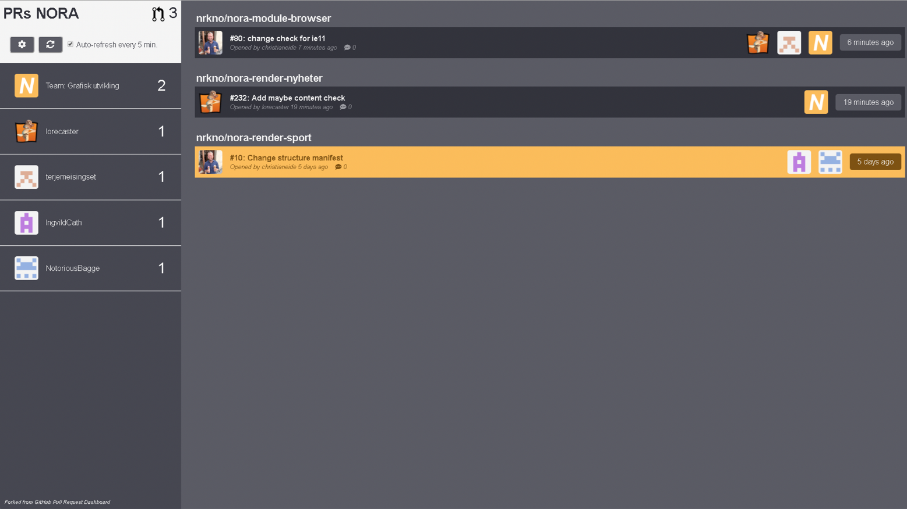

# github-pr-dashboard

See pull requests at a glance, across multiple repos

This is a edited version from the original `https://www.github.com/joeattardi/github-pr-dashboard`.

This version focus on whos asked for a review on a pull requets. It will also sort the pull requets by repository.

Pull requests with a requested changes will be marked as red. Stale pulls is also validated against last change, not when they were opened.

This fork also have som designchanges to the dashboard as well as updating some of the NPM-packages.

# Setup
After cloning the repository, run `npm install` to install dependencies.
To build the client-side code, run either `npm run dev-build` (if you're developing)
or `npm run build`.

# Configuration

Copy the file `config/config.json.sample` to `config/config.json`. If you are accessing public GitHub, you don't need to change the `apiBaseUrl` option. If you are accessing a GitHub Enterprise instance, you will need to set `apiBaseUrl` to the base URL of your GitHub Enterprise installation, e.g. `https://github.mycompany.com/api/v3`.  To use the GitHub Personal Access Token for accessing private repositories, `username` and `password` lines in `config/config.json` can be replaced with a single `"token": "MY_PERSONAL_TOKEN"` line. 

GitHub places a very strict rate limit on unauthenticated requests. If you run into this problem, you will need to add your GitHub username and password in `config.json`.

# Running the server
To run the PR dashbaord server, run `npm start`. This will start the server, listening on port 8080. You can change the port number by setting a `PORT` environment variable, e.g. `export PORT=80`.

## Running with Docker

You can build and run a Dockerized version of the app within a container without installing any dependencides locally.
Make sure you have already created a `config.json` as described above.

To build a new application image, in the project directory run:

`docker build -t joeattardi/github-pr-dashboard .`

To run the application:

`docker run -p 8080:8080 -d joeattardi/github-pr-dashboard`

or if you specified a custom `PORT` to run the app on:

`docker run -p $PORT:8080 -d joeattardi/github-pr-dashboard`

# Adding repositories
Once the server is running, visit it in your web browser and click the gear icon.
